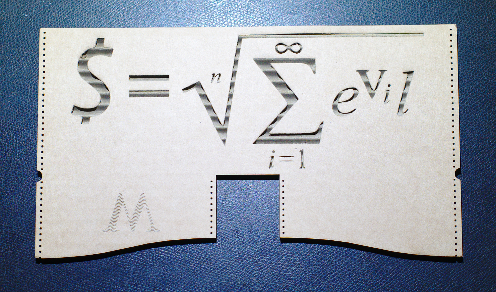
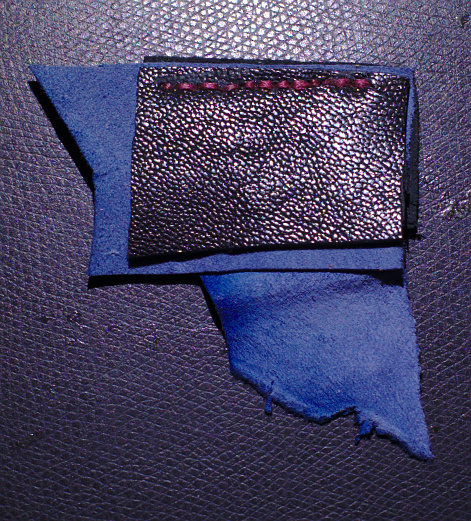
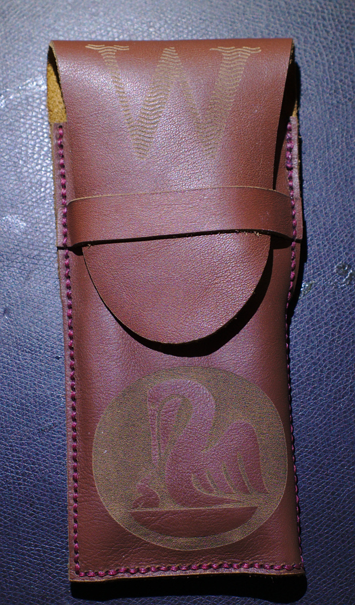
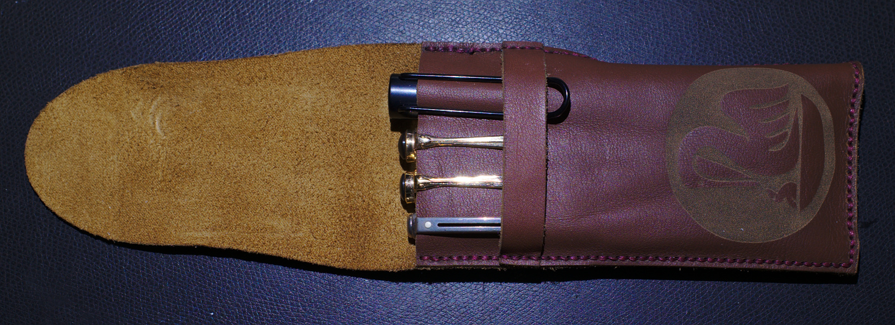
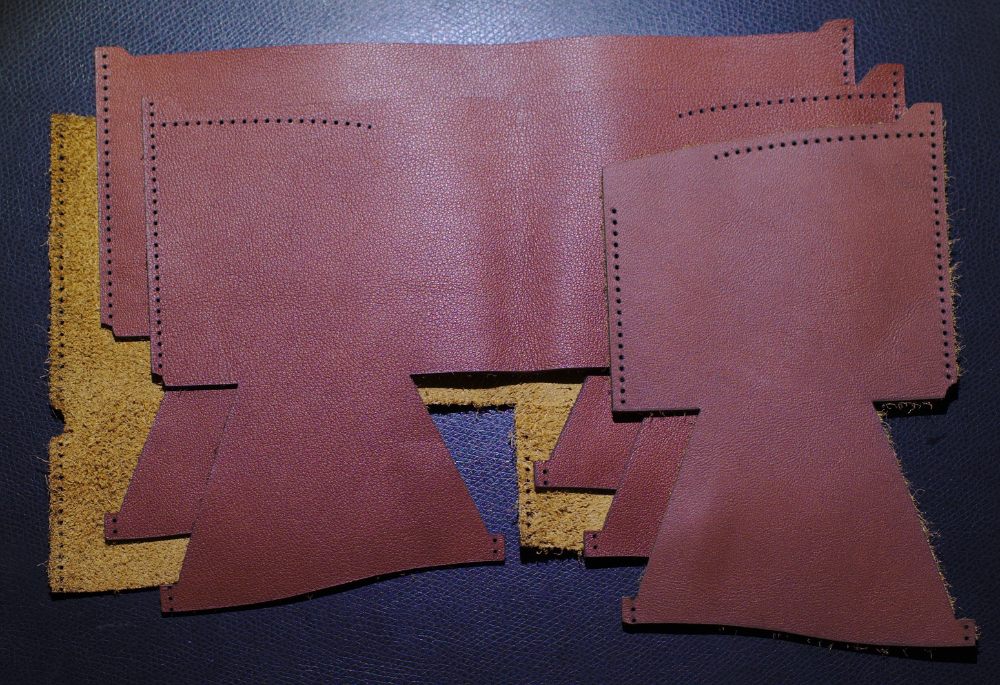
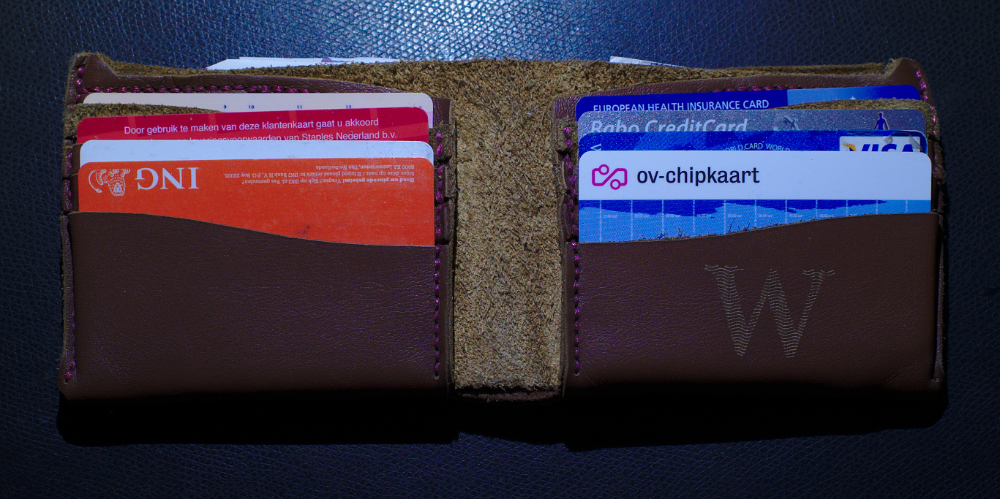
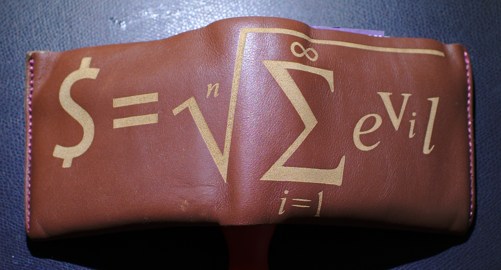

# Leather

This project contains layouts for a fountain pen holder a wallet made of
leather.

The designs were first made in [valentina](http://valentina-project.org/), an
open source pattern designer. After svg export they were imported into Adobe
Illustrator where the decals were added. Then export to dxf, cleanup in
[qcad](https://qcad.org/en/), and off to the laser cutter.

## Introduction

My local fablab held an open-house a couple of months ago. Their laser cutter
got me thinking that now would be a good time to finally make that leather
wallet I had been wanting to make for quite some time.

## Leather

Leather used was cow leather of approximate 1.0mm thickness, and lamb leather
of 0.8mm thickness. You buy leather in feet, with the express knowledge that
you are buying an animal hide. This means that there are variations in colour,
thickness and overall shape of the leather. The work material will need to be
cut to size and some material will be lost.

### Stitches

Leather is very strong, and the stitches need to be able to take some stress
when the wallet is handled. I bought 150D waxed red thread from eBay and did
some experiments to determine my "best" inter-hole distance, 3mm. That distance
was then also used as the distance from the hole to the edges of the leather.

Note that stitching straight in leather is hard...

A couple of Internet DIY leather sites show how to stitch leather:

* Start with a length of thread about 4x the length of the seam
* Add a needle on both ends of the thread. Thread the needle, and then pin the
  needle through the thread to ensure that it is securely fastened. This will
  allow usage of force while sewing.
* Thread the first hole, and ensure that there is the same amount of thread
  left on either side of the hole.
* Now move to the next hole with the first needle, and then while pulling the
  first needle back thread the second needle through the same hole. Afterwards
  you end up with two threads going through each hole.
* Make sure the second needle does not pierce the thread of the first, as this
  hampers you when pulling the thread to ensure a tight seam.
* After a seam is done, continue sewing by going back a few holes. This adds
  more threads through the same hole, increasing the strength, but also ensures
  that the seam will not unravel if the end knot breaks.
* It is possible to hide the end knot in the hole with some clever
  tying. Unleash your inner boy scout.

## Fountain pen holder
As a first off, to test laser cutting of leather and a test run of the process
and the tools I made a leather fountain pen holder.

Must:

* Carry 4 fountain pens
* Pen size ~ Lamy Vista / All Star, Pelikan M400
* Contain entire pen, flag over top to close

This resulted in me learning how to operate a laser cutter, what process works
to get laserable files, and what settings are needed to actually cut and
engrave leather.

* Lamb leather is too frail for laser etching, anything with a picture
  "engraved" on it will rip quickly.
* Laser cutter parameters:
  * Cutting: speed 80, power 60
  * Engraving: speed 400, power 20
* The laser cutter is so precise and violent that it has no trouble making small
  holes in the exact position I wanted to stitch. This speeds up alignment of
  leather pieces and speeds up the sewing process.
* Behave when you engrave. I went overboard.
* Stating the obvious: burnt leather stinks. Make sure the owner of the laser
  knows this or has good ventilation.

## Wallet

The broad idea is to stack a number of leather pieces which are folded. The
design was inspired by
[how-to-make-a-wallet](http://www.artofmanliness.com/2012/11/30/how-to-make-a-wallet/)
by the people behind [Bison Made](http://www.bisonmade.com). Consider buying from them
if you are looking for a nice leather wallet. DIY is about twice the price of
one of their wallets, with half of the looks.

However; I was in for the experience and no commercial wallet has quite what I
need:

* Carry EU 160x82mm, UK 156x85mm and US 156x66mm currency -> 160x85mm
* Have two currency slots, allows to separate different currencies while
  traveling, or separate currency and receipts.
* Space for 8 "credit" cards
* Additional space for OTP cards or pictures
* Simplicity in design; so ideally only 4 pieces of leather sewn together.

Currency slot 1 is formed between layer 1 and layer 2, currency slot 2
is formed between layer 2 and layer 3. The pocket layer finally attaches to
slot 3. The other layers are of different lengths, and fold to make credit card
slots on top of layer 4. Here layer 1 stops first, layer 2 is a bit longer and
forms slot 2, and on.

My first wallet used lamb leather for the most inside leather layer. This
turned out to be too weak to support the pockets. It deforms to such an extend
that rough handling will probably ruin the wallet.

The first wallet also showed that folding leather requires to take the extra
space taken up by folding the inner layers into account. With the leather not
being quite uniform in thickness this required some guesswork.

I like how it all turned out, and use these two items daily.

That said; the wallet is quite thick. At the sides there are 4 pieces of
leather folded over in such a way that they make a 5mm thick edge. At the
bottom the 4 layers are completely folded, so you get 8mm in thickness. This
helps with rigidity, but also makes for a large item in your pocket.
